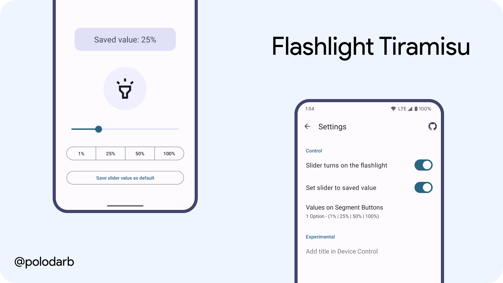

# Flashlight-Tiramisu

# Description
An application that allows you to smoothly adjust the brightness of the flashlight on some devices with Android 13
### Main Screen
In Main Screen, you have a large convenient button to turn the flashlight on and off, a slider and 4 small buttons to quickly set the value to the N position. You can also save the value of the slider and after each launch of the application, the slider will be set to the saved state. 
### Settings Screen
In the settings menu, you can change how the flashlight works to your liking. There is also a button with explanations of all settings items.
### Tile in QS
- By clicking on a tile, it turns on the flashlight at the saved value.
- Saved value displayed in tile subtitle.
- Long press on a tile opens the app
# Supported Device
Flashlight brightness control only supports HAL version 3.8 and higher, so among the supported devices, the latest ones (For example, Pixel 6/7, Samsung S23, etc.)
# Download

# Thanks
- [Nail Sadykov](https://t.me/nailsad_eleos) for testing the application during development
# Support Me

